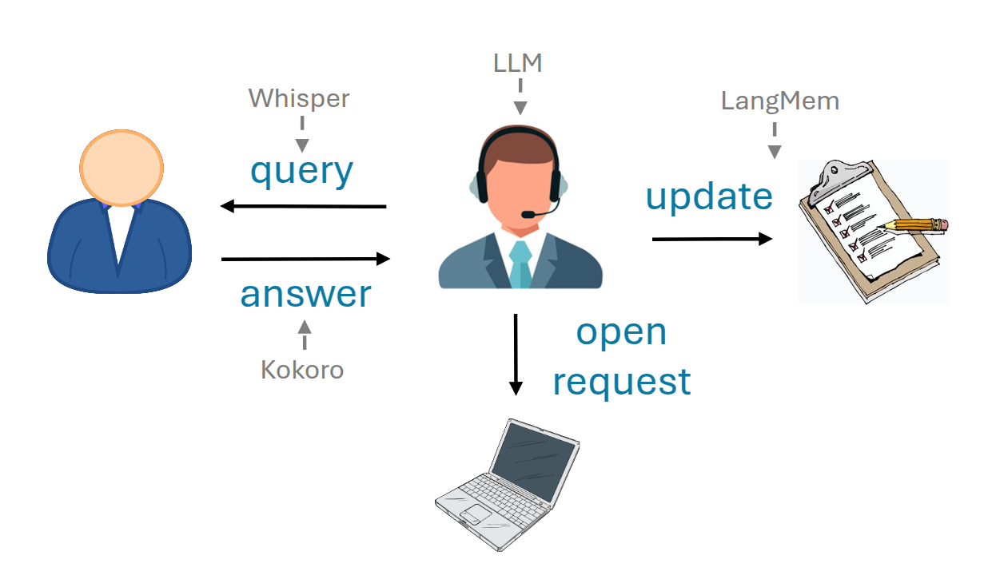

# Call center agent - based on LangMem memory extractor

Call center agent supports voice interactions using:
- [OpenAI's Whisper](https://platform.openai.com/docs/guides/speech-to-text) for speech-to-text
- [Kokoro](https://huggingface.co/spaces/hexgrad/Kokoro-TTS) for text-to-speech

LangMem memory manager is used to collect and track information given by the user during the call

### Graph definition

### Demo video

### Installation

- Whisper and Kokoro run locally on NVIDIA GeForce RTX 3060 12G with decent performance
- An OpenAI API key is needed
- Install ffmpeg for audio support: sudo apt install ffmpeg
- Clone the project to a directory of your choice: git clone https://github.com/itamab/Paper-Club.git
- Got to Call_Center directory: cd Paper-Club/Call_Center
- Create a python enviroment: python3 -m venv /path/to/PythonEnvs/paper_club/call_center 
- Install requirements: /path/to/PythonEnvs/paper_club/call_center/bin/pip install -r requirements.txt
- Run jupyter: /path/to/PythonEnvs/paper_club/call_center/bin/jupyter lab
